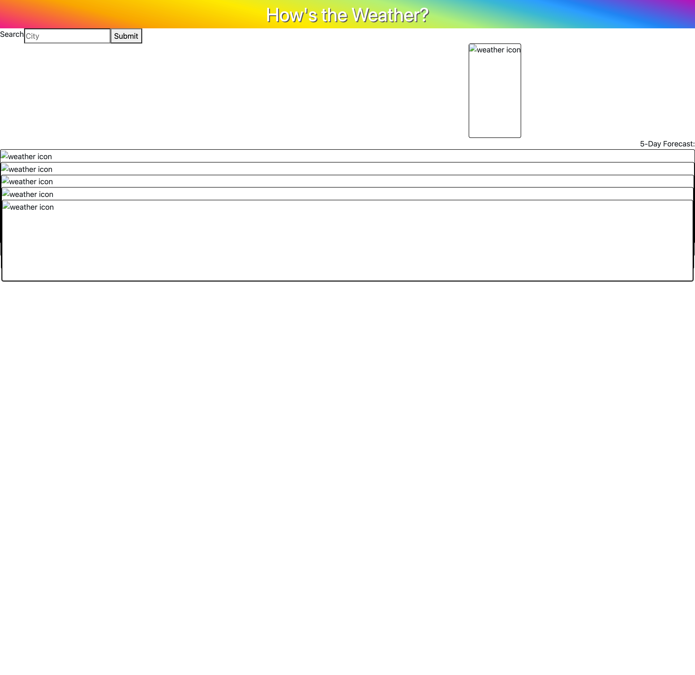
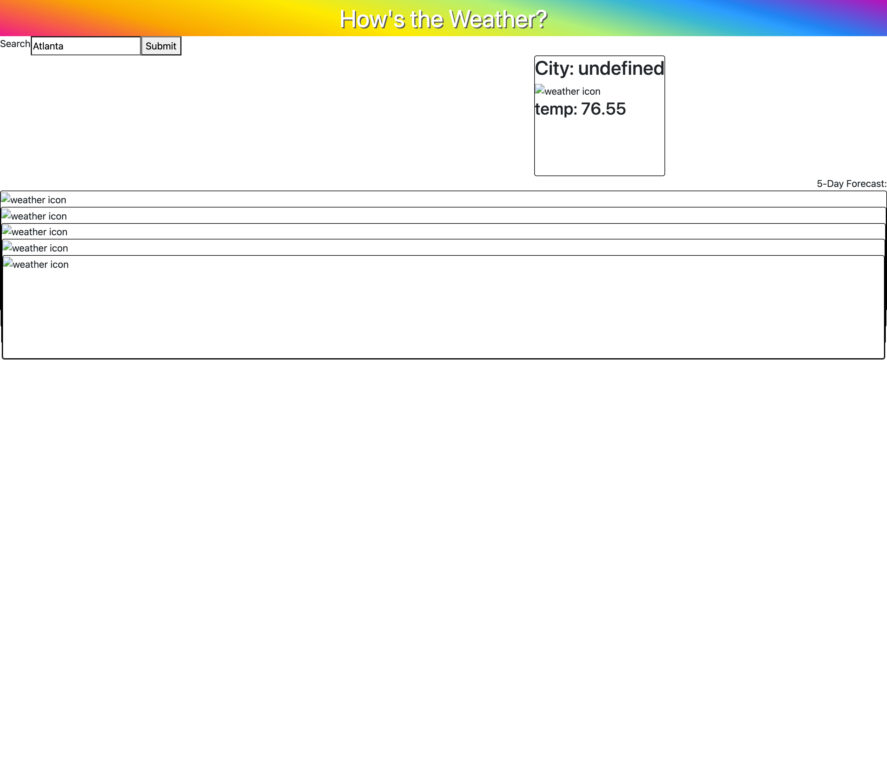

# 5day-weather-forecast-app
An app to view the 5-day forecast in a specified location.

## Desired Functionality 
A weather forecasting app that allows the user to search for any city, worldwide. The app displays the current weather for the searched city in a dahsboard, showing the weather, wind speed, temperature, humidity, and UV Index. The app then displays 5 forecast cards that contain the weather forecast for the next 5 days. The users searched cities are displayed below the search box, and will repopulate the corresponding city's data to the dashboard and forecast cards when clicked.

## Actual Functionality  
For now, the only data returning properly from the API is the temperature. The styling needs organization, including the forecast cards displaying horizontally when viewport width is above 576px. The data does not persist after the page is refreshed; local storage is needed. 

## Screen Shots  
The following images represent the actual functionality of the app.  

